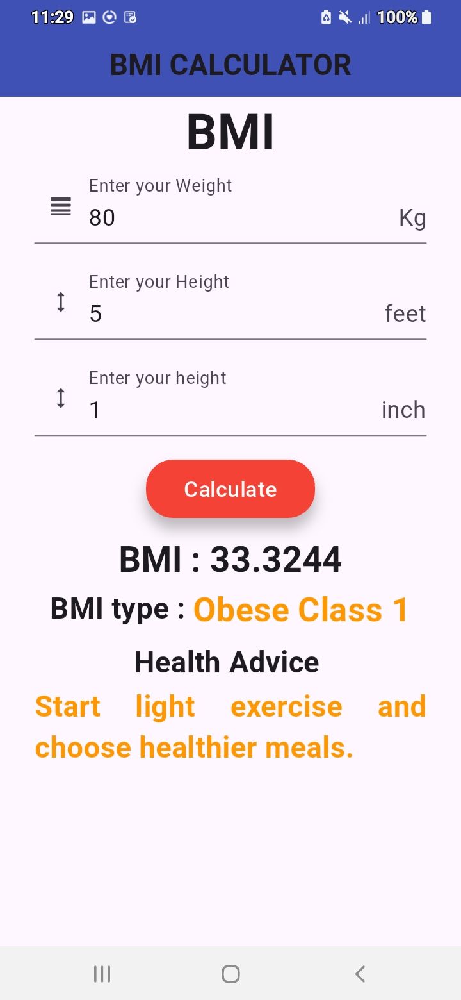
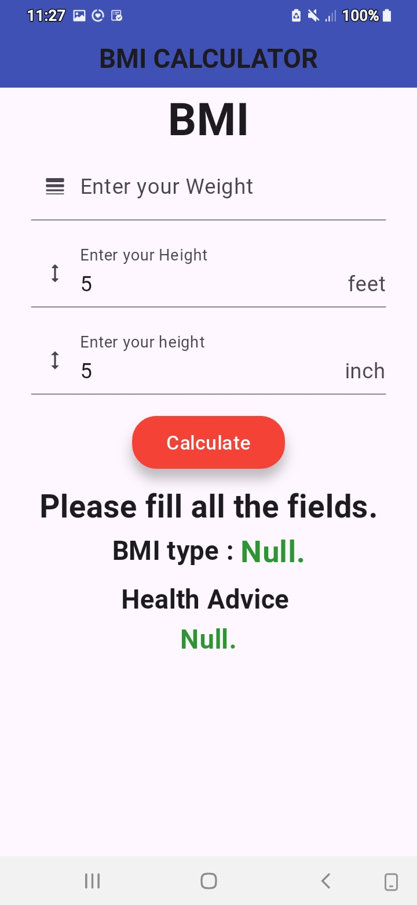

# BMI Calculator App 🧮

A simple Flutter application that allows users to calculate their Body Mass Index (BMI) based on height and weight input. Built using Flutter for both Android and iOS platforms.

## 🚀 Features
- Height and weight Input 
- Real-time BMI calculation
- BMI Categories(Underweight,Normal,Overweight,Obese Class 1,2..)
- Health Advice according to the bmi
- Clean, responsive UI

## 📸 Screenshots

### Result Screen


### Error Handling


## 🛠️ Technologies Used

- Flutter
- Dart
- VS Code

## 📦 How to Run

1. Clone this repo:
   ```bash
   git clone https://github.com/Adnan3792/bmi_calculator.git
   cd bmi_calculator

